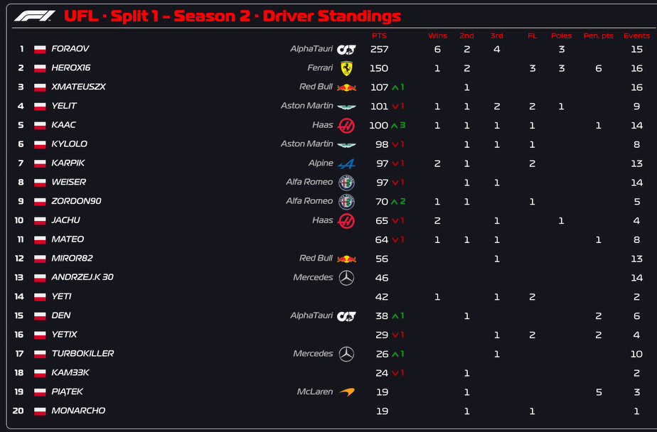
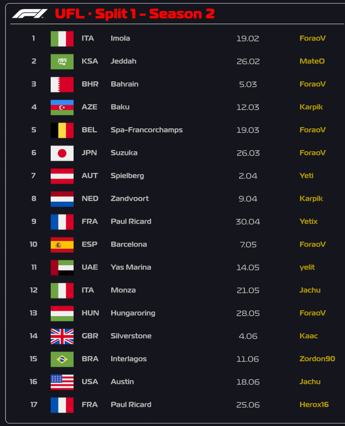
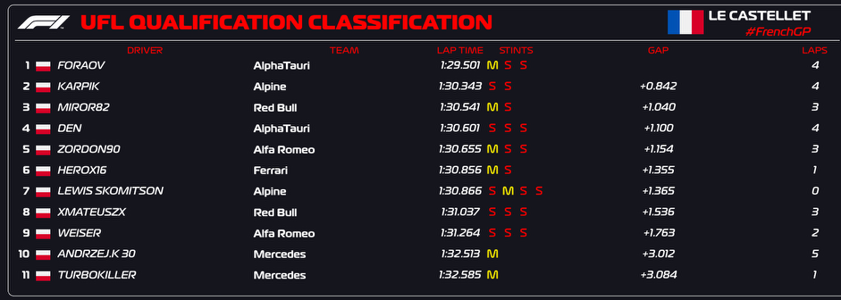
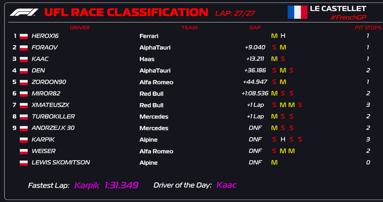
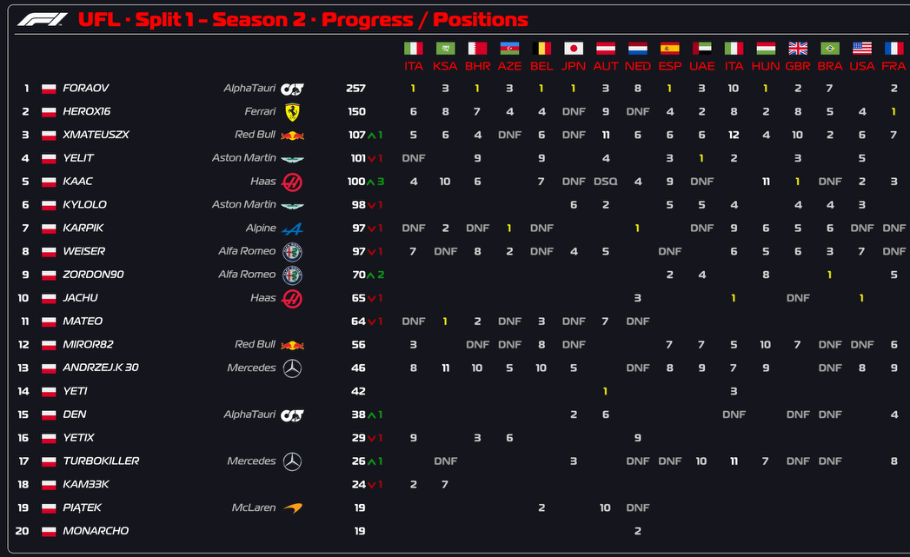
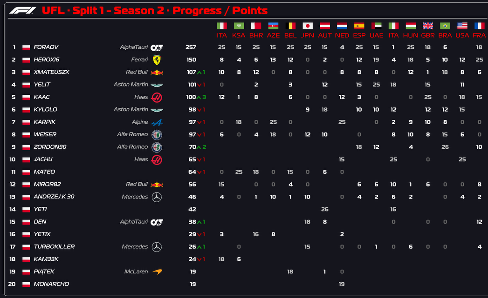
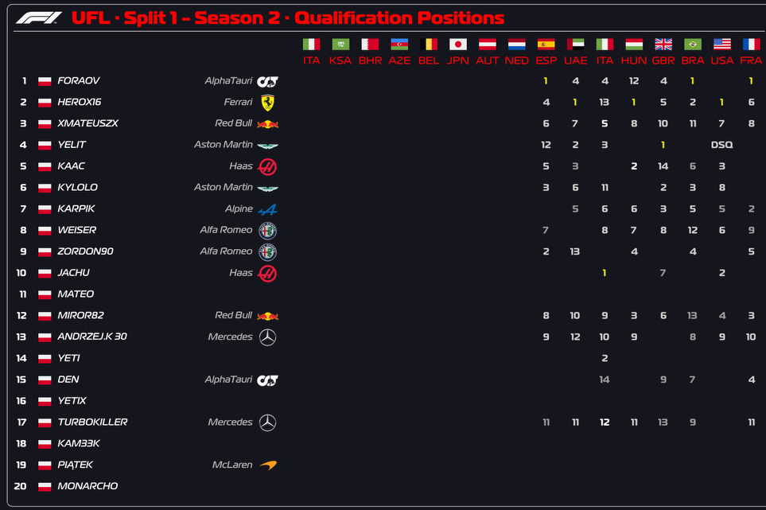
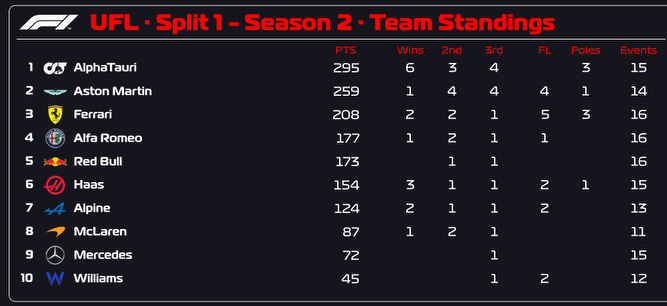
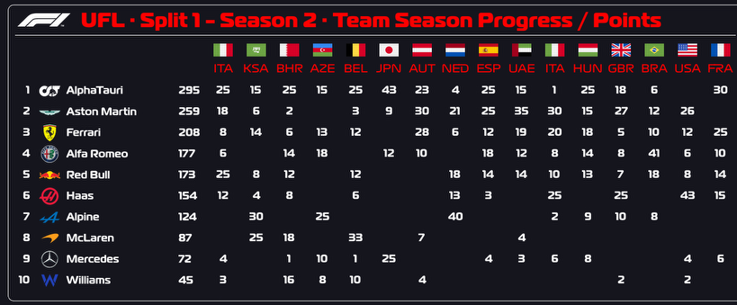
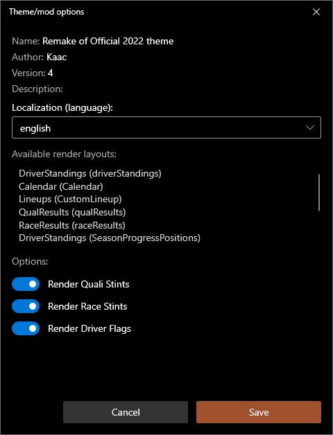

# Official 2022 Theme Remake

This is Remake of Official Theme F1 2022 event results layout for Racing League Tools

## Installation

Unpack the .zip file in the Racing League Tools location

```
RacingLeagueTools/user/mods/
```

## Features

### Available render layouts:

- DriverStandings (driverStandings)



- Calendar (Calendar)



- Calendar v2

- QualResults (qualResults)



- CombinedQual Results

- RaceResults (raceResults)



- DriverStandings (SeasonProgressPositions)



- DriverStandings (SeasonProgressPoints)



- DriverStandings (SeasonProgressQualificationPositions)



- TeamStandings (teamStandings)



- TeamStandings (SeasonTeamProgressPoints)



- Lineups (Lineup)


- QRL Joker's Lineup

- Drivers Season Statistics

- Drivers Session Statistics

- Race Battles Statictics


Official renders of the session results do not always have information about the tires used during the session, so it is possible to disable their display.
Just change particular options in Theme options window.




## License
[MIT](https://choosealicense.com/licenses/mit/)
