### If you like my work and would like to support me, buy me a coffee or two :)

<a href="https://www.buymeacoffee.com/kaaac" target="_blank"></a>

# Official 2022 Theme Remake

Remake of the official F1 2022 result layouts for Racing League Tools.

Requires **RLT 0.9.8 or newer** — the theme was rewritten for the Flex Renderer and will not load
on older versions. If you are still on 0.9.5, grab the
[v0.8.1](https://github.com/kaaac/Official-2022-Theme-Remake/releases/tag/v0.8.1) release instead.

## Installation

Unpack the .zip into the Racing League Tools folder:

```
RacingLeagueTools/user/themes/
```

Then pick the theme in RLT settings. On older versions this used to be `user/mods/` — that path
is gone.

## Layouts

| Render type | Layouts |
| --- | --- |
| Race results | Race results |
| Qualifying results | Qualifying |
| Combined qualifying | Combined qualifying |
| Driver standings | Standings, season progress by positions, by points, by qualifying positions |
| Team standings | Standings, season progress by points |
| Calendar | Calendar, plus a two-column variant |
| Lineups | Custom lineup |
| Driver statistics | Season and session |

### Race results

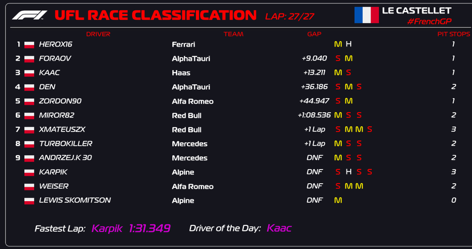

### Qualifying

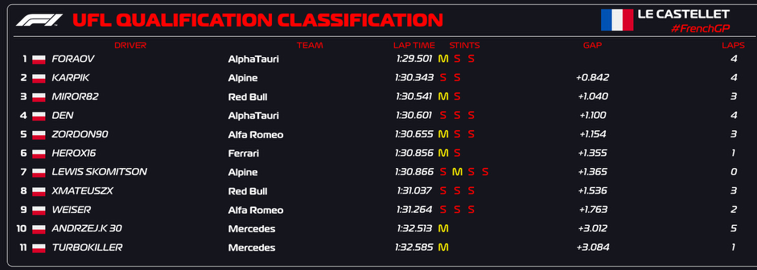

### Driver standings

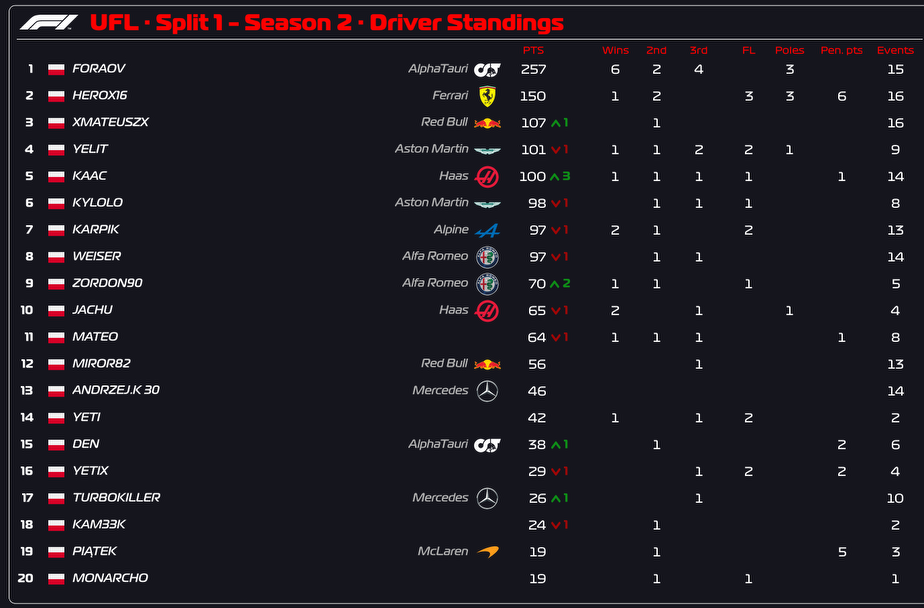

### Team standings

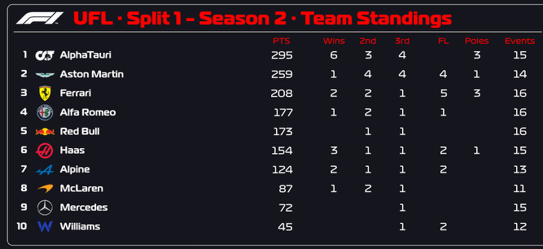

### Season progress

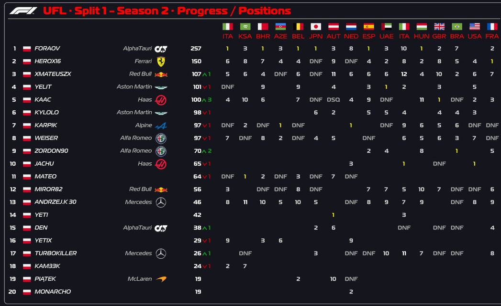

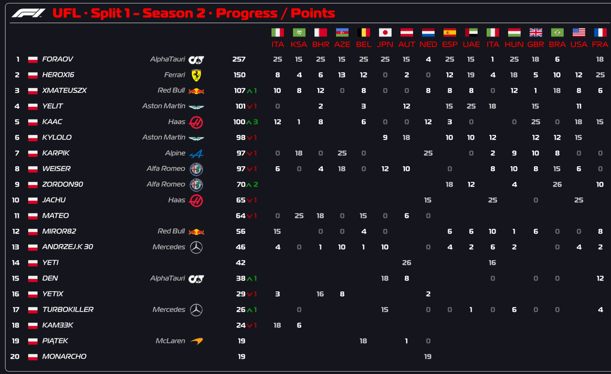

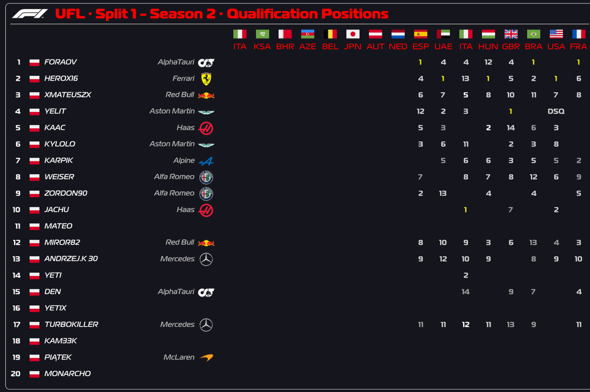

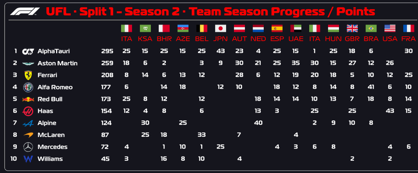

### Calendar

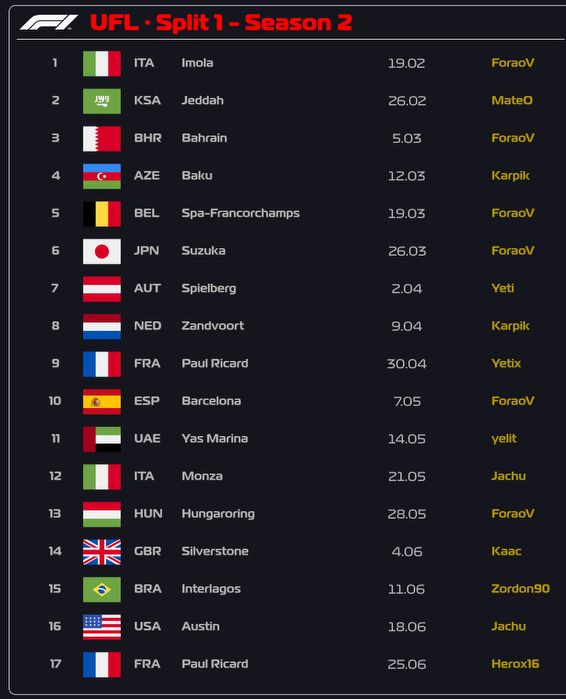

### Lineups

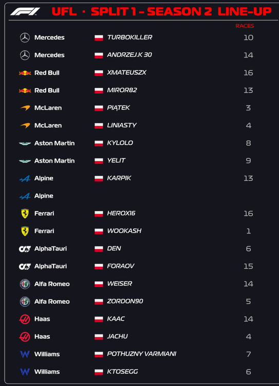

## Theme options

Results coming from the game do not always carry tyre data, so the stint columns can be switched
off. Same goes for team badges, driver flags, the commentator sticker and a few other bits. You
will find them in the Theme options window, grouped by the render they affect.

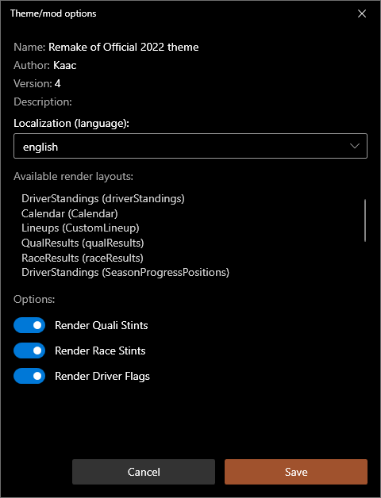

## License
[MIT](https://choosealicense.com/licenses/mit/)
